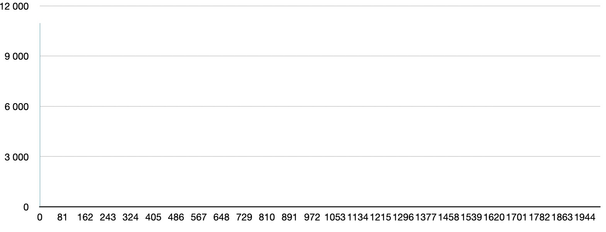
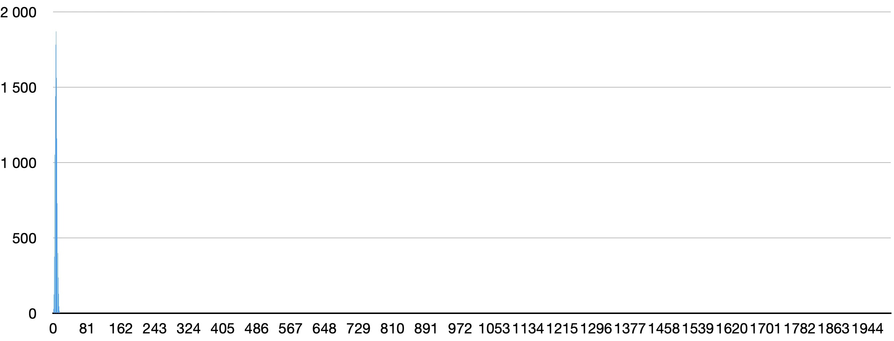
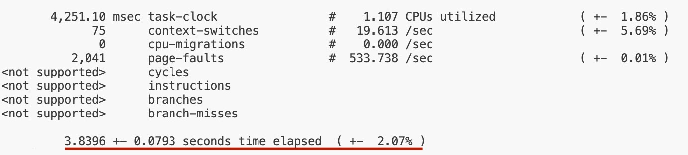
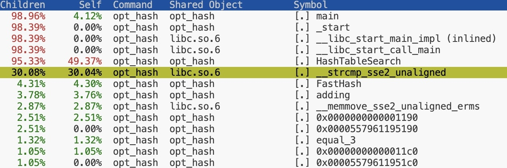
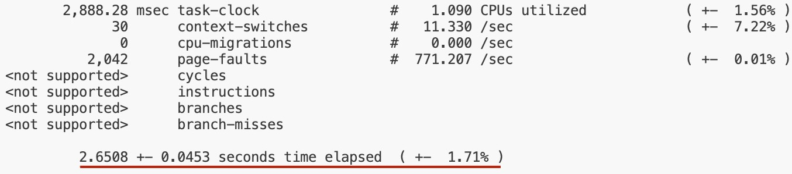

# Хэш-таблица
## Описание проекта.
В данном проекте проводилось два этапа работы:
- Сравнение семи различных хэш-функций по равномерности распределения элементов в хэш-таблице.
- Профилирование программы и оптимизация функций, которые занимают наибольшую часть времени выполнения программы, в частности функции поиска элемента в хеш-таблице.

## Реализация Хэш-таблицы
В данной реализации хэш-таблица представляет из себя массив структур с индексами, соответствующими хэш-значению* подмножества. Структура состоит из размера подмножества таблицы и указателя на список с элементами таблицы.

Для таблицы определена хэш-функция, которая сопоставляет каждому элементу натуральное число, которое является номером подмножества таблицы.

__* Результат хеш-функции берется по модулю размера таблицы.__

## Фактор загрузки
Фактор загрузки это отношение количества элементов к размеру хеш-таблицы, то есть количество элементов в одном подмножестве таблицы при их равномерном распределении.

В данном проекте для анализа взято произведение "Мастер и Маргарита" (в английском переводе), состоящее из 10962 слов. При обработке текста были "выброшены" все знаки препинания. В исследовании функций был взят размер хэш-талицы 2000, так фактор загрузки составил примерно 5.5, за счет чего видна неравномерность распределения элементов.

## Коллизии в хэш-таблице
В зависимости о хэш-функции, хэш-таблица имеет коллизии*, которые напрямую влияют на поиск элемента в таблице.

[Наглядная схема, иллюстрирующая коллизии](https://www.geeksforgeeks.org/java-program-to-implement-hash-tables-chaining-with-doubly-linked-lists/)


__* Коллизия - совпадений значений хэш-значений двух или более объектов.__

## Исследование хэш-функций
"Заселенность" хэш-таблицы будет показана с помощью гистограмм. По горизонтали указан номер подмножества таблицы. По вертикали количество элементов в соответствующем подмножестве.

Критерием сравнения функций будет дисперсия, которая показывает на сколько равномерно распределены элементы в таблице. Поэтому чем меньше ее значение, тем качественнее хэш-функция.


### Хэш-функции
Я тестировал следующие хэш-функции:
- **HashRetZero**

  возвращает 0.
- **HashFirstAscii**

  возвращает ASCII-код первого символа слова.
- **HashWordLen**

   возвращает длину слова.
- **HashAsciiSum**

  возвращает сумму всех ASCII-кодов слова.
- **HashOriginal**

  возвращает сумму всех ASCII-кодов слова, деленную на длину слова.
- **HashRorAscii**
- **MurmurHash**

### 1. HashRetZero



В данном случае все элементы таблицы размещены в первом подмножестве таблицы.

Очевидно, что эта хэш-функция обладает низким качеством, так как поиск в таблице превращается в стандартный линейный поиск в одномерном массиве.

### 2. HashFirstAscii


Пик коллизий приходится на начало таблицы, так как ASCII-коды символов, которые хэшируют элемент, ограничены значением 255.

### 3. HashWordLen



Мы получили такой результат, так как, длина элемента, в большинстве случаев не превосходит даже 50 элементов, при этом размер таблицы 2000, за счет чего пик коллизий приходится на начало таблицы.

### 4. HashAsciiSum

Данная функция будет исследована при стандартном размере хеш-таблицы и при размере 256. Для второго из них коэффициент загрузки составляет приблизительно 43.

#### Размер 256:


На первый взгляд хэш-функция показывает достаточно хороший результат распределения, однако, это характерно только при сравнительно небольших размерах таблицы.

#### Размер 2000:


Как видно здесь уже возникает проблема с коллизиями, все из-за того, что у суммы ASCII-кодов ограничена некоторой константой. Так первый вариант показывает неплохую "заселенность", но при больших размерах таблицы появляется пик коллизий и распределение перестает быть равномерным.

### 5. HashOriginal


Пик приходится на начало таблицы, это обусловливается тем, что в данной функции используется сумма ASCII-кодов и длина, обе этих величины ограничены.

### 6. HashRorAscii


Данная функция так же как и представленные выше имеет пики, при этом они распределены по всему размеру таблицы, что говорит о достаточно неплохом хэшировании, но нельзя сказать, что таблица с данной хэш-функцией будет наиболее подходящей для поиска.

### 7. MurmurHash


```MurmurHash``` - достаточно известная хэш-функция. В данном случае распределение равномерное и не имеет пиков.

Об алгоритме этой хэш-функции можно прочитать здесь [MurmurHash2](https://ru.wikipedia.org/wiki/MurmurHash2)


### Анализ полученных результатов
| Хэш-функция | Дисперсия |
|:-----------:|:---------:|
|MurmurHash|5.79|
|HashRorAscii|23.68|
|HashAsciiSum (256)| 54|
|HashAsciiSum (2000)|81|
|HashFirstAscii| 2799     |
|HashOriginal| 5503|
|HashWordLen| 7263|
| HashRetZero |   60083   |


Среди исследованных функций лучшей является ```MurmurHash```. Этот результат является ожидаемым, поскольку данный алгоритм используется на практике. Во второй части данного проекта эта функция будет использоваться по умолчанию.

## Оптимизация программы
Главной задачей данной части является оптимизация функции поиска. При этом в рамках данного проекта нужно использовать оптимизацию с помощью ассемблерной вставки, интринсик-функций и написания функции на ассемблере.

Начальные данные:
- размер хэш-таблицы: 2000.
- количество слов для поиска: 10962.

Профилирование программы будет производиться с помощью ```perf```. А именно ``perf stat`` для подсчета времени работы программы и ``perf record`` для выявления узких мест в программе, то есть функций, которые занимают наибольшую часть времени работы программы.

Для тестирования функции поиска запустим ее в цикле на 100'000'000 итераций и 10 запусков программы через ```perf stat```.

### Профилирование не оптимизированной программы
Как мы можем видеть из картинки ниже именно функции ```HashTableSearch```, ```MurmurHash``` и ```strcmp``` имеют наибольшие затраты.


Так же приведу отчет ``perf stat`` по времени работы программы.



### Оптимизация хэш-функции ассемблерной вставкой
Как можно увидеть из отчета ниже, ```MurmurHash``` является максимальной по времени работы среди всех остальных функций, если не считать функцию поиска.

Чтобы сократить время работы хэш-функции, я перепишу алгоритм CRC32-хэш на ассемблере, код которого представлен ниже.

<details>

<summary>FastHash</summary>

```c
    static  u_int64_t jmp_table[32] =
            {
            (u_int64_t)equal_1, // == 1
            (u_int64_t)equal_2, // == 2
            (u_int64_t)equal_3, // == 3
            (u_int64_t)equal_3, // == 4
            (u_int64_t)equal_4, // == 5
            (u_int64_t)equal_5, // == 6
            (u_int64_t)equal_6, // == 7
            (u_int64_t)equal_7, // == 8
            (u_int64_t)equal_8, // == 9
            (u_int64_t)more_8,  // == 10
            (u_int64_t)more_8,  // == 11
            (u_int64_t)more_8,  // == 12
            (u_int64_t)more_8,  // == 13
            (u_int64_t)more_8,  // == 14
            (u_int64_t)more_8,  // == 15
            (u_int64_t)more_8,  // == 16
            (u_int64_t)more_8,  // == 17
            (u_int64_t)more_8,  // == 18
            (u_int64_t)more_8,  // == 19
            (u_int64_t)more_8,  // == 20
            (u_int64_t)more_8,  // == 21
            (u_int64_t)more_8,  // == 22
            (u_int64_t)more_8,  // == 23
            (u_int64_t)more_8,  // == 24
            (u_int64_t)more_8,  // == 25
            (u_int64_t)more_8,  // == 26
            (u_int64_t)more_8,  // == 27
            (u_int64_t)more_8,  // == 28
            (u_int64_t)more_8,  // == 29
            (u_int64_t)more_8,  // == 30
            (u_int64_t)more_8,  // == 31
            (u_int64_t)more_8,  // == 32
            };

    u_int64_t hash = 0;

    asm
    (
        "lea rbx, %4        ;\n"
        "xor r11, r11       ;\n"
        "xor r10, r10       ;\n"
        "jmp [rbx + rsi * 8];\n"

        "more_8:            ;\n"
        "mov r9d, [rdi]     ;\n"
        "crc32 r10d, r9d    ;\n"
        "add r11, r10       ;\n"
        "sub rdi, 8         ;\n"
        "sub rsi, 8         ;\n"
        "jmp [rbx + rsi * 8];\n"

        "equal_8:           ;\n"
        "mov r9d, [rdi]     ;\n"
        "crc32 r10d, r9d    ;\n"
        "jmp adding         ;\n"

        "equal_7:           ;\n"
        "mov r9, [rdi]      ;\n"
        "mov bx, [rdi + 4]  ;\n"
        "xor ebx, r9d       ;\n"
        "mov r9b, [rdi + 6] ;\n"
        "xor r9b, bl        ;\n"
        "crc32 r10d, ebx    ;\n"
        "jmp adding         ;\n"

        "equal_6:           ;\n"
        "mov r9d, [rdi]     ;\n"
        "mov r10w, [rdi + 4];\n"
        "crc32 r10d, r9d    ;\n"
        "jmp adding         ;\n"

        "equal_5:           ;\n"
        "mov r9d, [rdi]     ;\n"
        "mov r10b, [rdi + 4];\n"
        "crc32 r10d, r9d    ;\n"
        "jmp adding         ;\n"

        "equal_4:           ;\n"
        "mov r9d, [rdi]     ;\n"
        "crc32 r10d, r9d    ;\n"
        "jmp adding         ;\n"

        "equal_3:           ;\n"
        "mov r9w, [rdi]     ;\n"
        "mov r10b, [rdi + 2];\n"
        "xor r9d, r10d      ;\n"
        "crc32 r10d, r9w    ;\n"
        "jmp adding         ;\n"

        "equal_2:           ;\n"
        "mov r9w, [rdi]     ;\n"
        "crc32 r10d, r9w    ;\n"
        "jmp adding         ;\n"

        "equal_1:           ;\n"
        "mov r9b, [rdi]     ;\n"
        "crc32 r10d, r9b    ;\n"

        "adding:            ;\n"
        "add r11, r10       ;\n"
        "and r11, 0x7ff     ;\n"
        "mov %0, r11        ;\n"

        :"=m"(hash)
        :"m"(hash), "m"(element), "r"(word_size), "m"(jmp_table)
        :"r9", "r10", "r11", "rsi", "rdi", "rbx"
    );

    return hash;
```

</details>


Уже с оптимизированной хэш-функцией сделаю профилирование программы


Как видно из картинки выше, вклад хэш-функции в общее время выполнения программы сократился почти в 5 раз.

Ускорение связано с тем, что новая функция не содержит ни одного цикла. Интересным побочным эффектом является, то что хеширование данной хеш-функции не зависит от длины слова (так как циклов нет). Это может дать еще большее ускорение на длинных словах.

Далее сравню время выполнения работы программы с ```MurmurHash``` и ```FastHash```.


| Ускорение от предыдущей версии | Ускорение |
|:------------------------------:|:---------:|
| 1.27                           | 21%       |

| Ускорение от не оптимизированной версии  | Ускорение |
|:------------------------------:|:---------:|
| 1.27                           | 21%       |

Так мне удалось получить достаточно хорошее ускорение выполнения всей программы с помощью оптимизации хэш-функции.

### Характеристика FastHash функции

Ниже приведена диаграмма распределения в хэш-таблице.


Дисперсия = 13.08

Хоть дисперсия данного распределения и больше дисперсии ```MurmurHash``` (5.79), функция все равно остается достаточно качественной, так как элементы распределены по всей таблицы.

### Промежуточный результат

Посмотрим промежуточный результат


Как видно из отчета функция сравнения занимает значительную часть программы. Поэтому попробуем оптимизировать именно ее.

### Оптимизация функции сравнения

Для оптимизации ```strcmp``` мы будем использовать функцию, написанную на ассемблере.

Текст, который используется для поиска не имеет слов длины больше 16 символов, поэтому перепишем функцию сравнения для частного случая.

Для этого воспользуемся xmm регистрами, которые могут хранить в себе 16 байт.

<details>

<summary>strcmp_asm</summary>

```asm
strcmp_asm: vmovdqu   xmm1, [rdi]
            vpcmpeqd  xmm0, xmm1, [rsi]
            vmovmskps eax, xmm0

            xor eax, 0xFF

            ret
```
</details>

Ниже приведу отчет ```perf record```




и отчет ```perf stat```




| Ускорение от предыдущей версии | Ускорение |
|:------------------------------:|:---------:|
| 1.14                           | 12%       |

| Ускорение от не оптимизированной версии  | Ускорение |
|:------------------------------:|:---------:|
| 1.45                           | 31%       |

Так же протестирую эту функцию, но буду использовать сравнение 32 символов, с помощью ymm регистров.


В данном случае функция не дала желаемого результата и среднее время работы программы не изменилось.

Скорее всего это произошло из-за того, что при инициализации хэш-таблицы на куче выделяется в два раза больше памяти.

Далее я попробую переписать функцию сравнения с использованием AVX2 intrinsics-функций.

#### Intrinsics-оптимизация

Для этого типа оптимизации я воспользовался simd-командами и написал функцию ```strcmp_simd```.

<details>

<summary>strcmp_simd</summary>

```c
    __m256i str1_buf = _mm256_load_si256 ((__m256i*)str1);
    __m256i str2_buf = _mm256_load_si256 ((__m256i*)str2);

    __m256i mask = _mm256_cmpeq_epi8 (str1_buf, str2_buf);
    int i_mask   = _mm256_movemask_epi8 (mask);

    if (i_mask == 0xFFFFFFFF)
        return 0;
    return 1;
```
</details>

Так я получил еще больший прирост относительно функции сравнения, написанной на ассемблере.


Как можно видеть программа ускорилась.

| Ускорение от предыдущей версии | Ускорение |
|:------------------------------:|:---------:|
| 1.13                           | 11%       |


| Ускорение от не оптимизированной версии  | Ускорение |
|:------------------------------:|:---------:|
| 1.64                            | 39%       |

С помощью интринсикс-функций мне удалось на 11% оптимизировать программу за счет использования платформозависимых функций.

### Результаты
| Версия программы | Ускорение от предыдущей версии | Ускорение от базовой |
|:----------------:|:------------------------------:|:---------:|
|CRC32 оптимизация |             1.27               | 1.27       |
|strcmp_asm |1.14|1.45|
|strcmp_simd| 1.13| 1.64|

## Вывод
Нам удалось ускорить функцию поиска в 1.64 раза, что является неплохим результатом. Возможно такой результат был получен, потому что я работал и тестировал программу на [сервере](https://timeweb.cloud/). Используя такие инструменты, как ```perf``` и ```objdump```, можно находить нужные объекты оптимизации и ускорять программу.
Главным критерием оценки оптимизации являлось минимальное использование платформозависимого кода. В связи с этим, предлагается оценить результат оптимизации, рассчитывая его по следующей формуле:

**result = (прирост производительности / количество строк платформозависимого кода) * 1000**

В данной работе он составил **result = (1.64 / 58) * 1000 = 28**.
